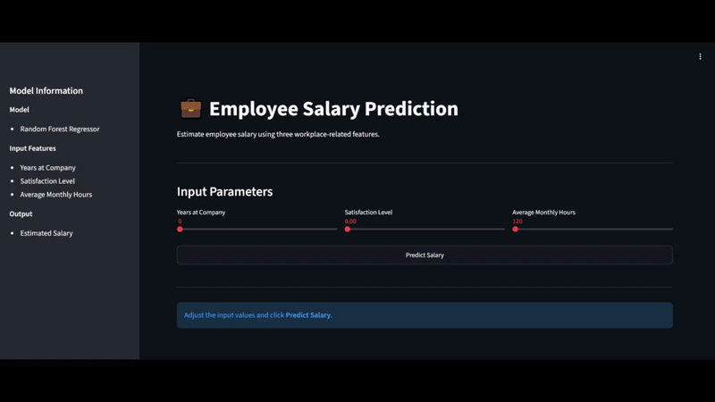
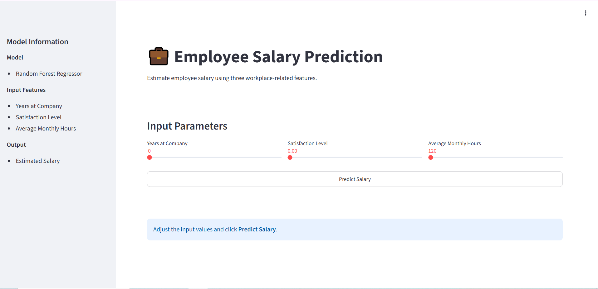
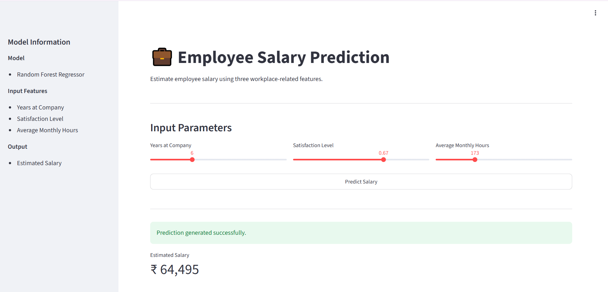
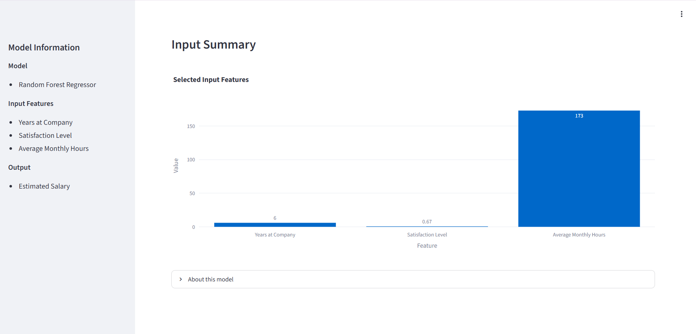

<h1 align="center">Employee Salary Prediction</h1>

<p align="center">
Interactive machine learning web application for estimating employee salary using a Random Forest regression model.
</p>

<p align="center">
  
  
  
  
  
  
</p>

Estimate employee salary from workplace-related features through a simple interactive web interface. The application loads a trained Random Forest regression model and provides predictions in real time.

**Machine Learning • Streamlit • Random Forest Regression**

---

## 🔗 Live Demo

**https://employee-salary-prediction-capstone.onrender.com/**

---

## Preview

<p align="center">
  
</p>

---

# Overview

This project demonstrates an end-to-end machine learning workflow, from model training to deployment.

A trained Random Forest regression model is served through a Streamlit interface where users can adjust input parameters and instantly receive a salary prediction.

The project focuses on presenting a machine learning model through a simple, interactive web application rather than building a production HR system.

---

# Highlights

- Interactive salary prediction web application
- Random Forest regression model
- Real-time predictions
- Input summary visualization using Plotly
- Streamlit-based interface
- Deployed on Render

---

# Screenshots

### Home

Interactive interface for entering employee information.



---

### Prediction

Displays the estimated salary after running the model.



---

### Input Summary

Visualizes the selected input features used for prediction.



---

# Technology Stack

| Layer | Technology |
|--------|------------|
| Language | Python |
| Machine Learning | scikit-learn |
| Web Framework | Streamlit |
| Data Processing | NumPy, Pandas |
| Visualization | Plotly Express |
| Model Persistence | Joblib |
| Deployment | Render |

---

# Project Structure

```text
.
├── assets/
│   ├── demo.gif
│   ├── hero.png
│   ├── prediction.png
│   └── input-summary.png
├── app.py
├── employee_attrition_data.csv
├── rfr_model.pkl
├── scaler.pkl
├── requirements.txt
└── README.md
```

---

# Getting Started

## Clone the repository

```bash
git clone https://github.com/HarshamIrfan/Employee-Salary-Prediction--Capstone-Project.git

cd Employee-Salary-Prediction--Capstone-Project
```

## Install dependencies

```bash
pip install -r requirements.txt
```

## Run the application

```bash
streamlit run app.py
```

---

# Model Information

| Item | Details |
|------|---------|
| Algorithm | Random Forest Regressor |
| Problem Type | Regression |
| Input Features | Years at Company, Satisfaction Level, Average Monthly Hours |
| Output | Estimated Salary |

---

# Future Improvements

- Evaluate additional regression models
- Hyperparameter tuning
- Feature importance visualization
- CSV batch prediction support
- Model performance metrics dashboard

---

# Author

**Harsham Irfan Bhat**

📧 harshamirfan@gmail.com

💼 https://www.linkedin.com/in/harsham-irfan-bhat/

---

If you found this project useful, consider giving the repository a ⭐.